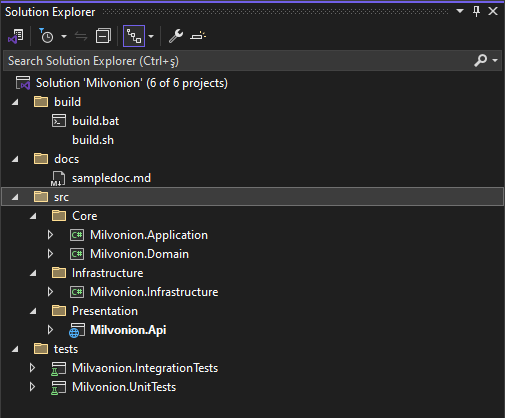
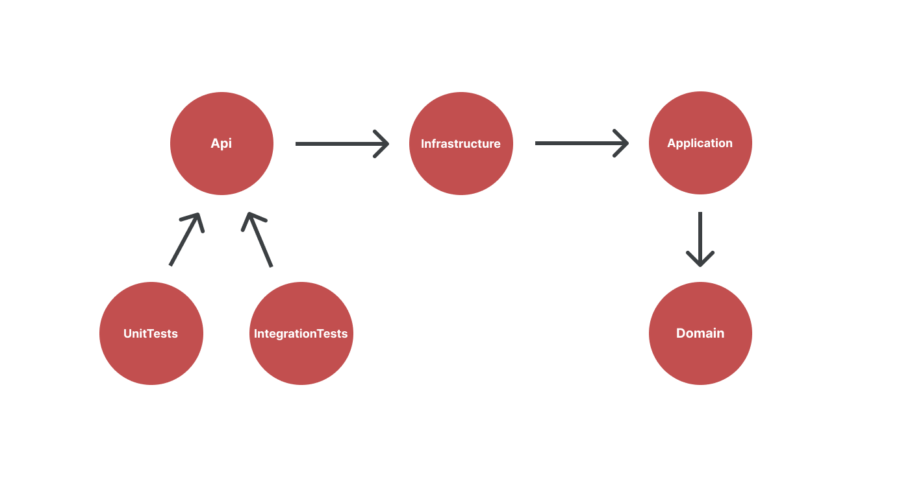

# Milvonion Api

This document is a guide to what you need to know about the project.

## Tech Stack

- .Net 10
- PostgreSql
- Docker

## Usage

You can use the following commands in the root folder of the project to run the project.

### Docker
```
docker-compose up -d
```

### Build Script

The scripts below publish the project and exports the test results in the `./tests/TestResults` folder. See `./build` folder for script logs.

> PostgreSql must be installed on your computer for the scripts to work properly because the commands run the tests.

For Windows;

```
cd build
build.bat
```

For Linux;

```
cd build
build.sh
```

Run published project;

```
dotnet ./artifacts/out/Milvonion.Api.dll
```

or on Windows double click on `./artifacts/out/Milvonion.Api.exe`


You can access the Api documentation at http://localhost:5000/api/documentation/index.html

---

## Project Structure



**Folders;**
- build : Contains build scripts.
- docs : Contains project documents.
- src : Contains source code.
- tests: Contains test projects source code.

**Layers;**

The layers has been designed by adhering to the principles of onion architecture. `.csproj` project dependencies are based on this architecture.


- **Core**
    - Domain: Contains the core business logic and entities.
    - Application: Implements use cases and orchestrates the interaction between the domain and infrastructure layers.
- **Infrastructure** 
    - Infrastructure: Handles business logic, external dependencies and technical logic.
    - Persistence: Database operations are made here
- **Presentation**
    - Api: This is the executable part of the project. Endpoints for the client are written here. Project configurations, files that will/will not be served to the client are here.
- **Tests**
    - UnitTests: Contains unit tests.
    - IntegrationTests: Contains integration tests.


## Folder Strutcure

```
src
 ├── Milvonion.Api
 |    ├── wwwroot 
 |    ├── AppStartup 
 |    ├── Controllers 
 |    ├── LocalizationResources
 |    ├── Middlewares
 |    ├── Migrations
 |    ├── StaticFiles
 |    └── Utils 
 |
 |
 ├── Milvonion.Infrastructure
 |    ├── Extensions
 |    ├── LazyImpl
 |    ├── Logging
 |    └── Persistence
 |    └── Services
 |    └── StorageProvider
 |    └── Utils
 |
 ├── Milvonion.Application
 |    ├── Behaviours
 |    ├── Dtos
 |    ├── Features
 |    ├── Interfaces
 |    └── Utils
 |
 └── Milvonion.Domain
      ├── Enums
      ├── UI
      └── JsonModels

tests    
 ├── Milvonion.IntegrationTest
 |   ├── StaticFiles
 |   └── TestHelpers
 |
 └── Milvonion.UnitTest
     ├── StaticFiles
     └── TestHelpers

docs
 └── documentation files

build
 └── build scripts

artifacts
 └── output files
```

The folders in the `src` folder are grouped under virtual folders as follows;

```
src
 ├── Core
 |    ├── Milvonion.Application
 |    └── Milvonion.Domain
 |
 |
 ├── Infrastructure
 |    └── Milvonion.Infrastructure
 |
 └── Presentation
      └── Milvonion.Api
```

## Project Dependencies



### Build Order of Projects 
1. Domain
2. Application
3. Infrastructure
5. Api
6. UnitTests
7. IntegrationTests

### Nuget Libraries Used 
- **Mediator/CQRS Design Pattern**
    - MediatR
    - Milvasoft.Components.CQRS
- **DB Access**
    - Npgsql.EntityFrameworkCore.PostgreSQL
    - Milvasoft.DataAccess.EfCore
    - Milvasoft.Interception.Ef
- **Auth**
    - Microsoft.AspNetCore.Authentication.JwtBearer
    - System.IdentityModel.Tokens.Jwt
    - Milvasoft.Identity
- **Health Check**
    - AspNetCore.HealthChecks.NpgSql
    - AspNetCore.HealthChecks.UI
    - AspNetCore.HealthChecks.UI.Client
    - AspNetCore.HealthChecks.UI.InMemory.Storage
- **Logging**
    - Serilog.AspNetCore
    - Serilog.Expressions
    - Serilog.Sinks.Postgresql.Alternative
    - Milvasoft.Interception
    - Microsoft.IO.RecyclableMemoryStream
- **Caching**
    - Milvasoft.Caching.InMemory
    - Milvasoft.Interception
- **Multi Language**
    - Milvasoft.Core.MultiLanguage
    - Milvasoft.Localization.Resx
- **Api Helpers**
    - Asp.Versioning.Mvc.ApiExplorer
    - Swashbuckle.AspNetCore
    - Milvasoft.Components.Rest
    - Milvasoft.Components.OpenApi
    - Milvasoft.Interception
- **Json SerDe**
    - System.Text.Json
- **Mapping**
    - Mapster
- **Test**
    - coverlet.collector
    - Microsoft.NET.Test.Sdk
    - xunit
    - xunit.runner.visualstudio
    - Microsoft.VisualStudio.Azure.Containers.Tools.Targets

For transitive package usage please see the nuget feed.

### Design Patterns Used
- CQRS
- Mediator
- Factory
- Singleton

### Performance and Scalability
The API is designed to work seamlessly even during high-traffic times. API endpoints are optimized with load balancing and caching techniques. Average response time is under 200ms.